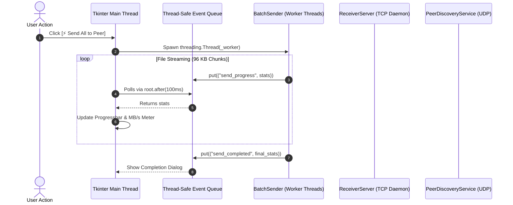
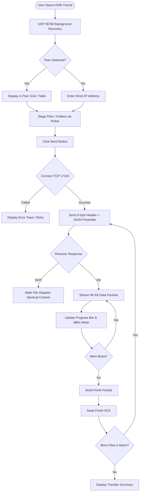
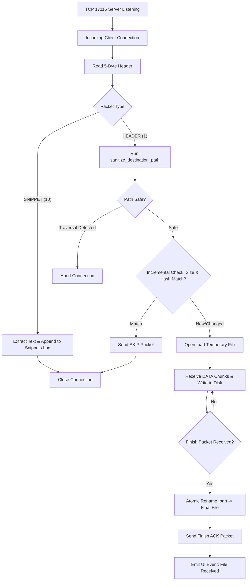

# RDR-Transit: UI/UX Specification & Interface Engineering Guide

> **Target Audience:** Frontend Engineers, UI/UX Designers, Autonomous Agents  
> **Scope:** Terminal User Interface (Textual TUI), Desktop GUI (Tkinter/ttk), and Mobile/Multiplatform Client (Flutter Material 3).  
> **Status:** Canonical Living Interface Reference

---

## 1. Design System & Visual Philosophy

RDR-Transit provides three complementary user interfaces tailored to different operational environments:
1. **Terminal User Interface (TUI)**: Keyboard-centric, `nmtui`-inspired, full-screen console client for SSH sessions, headless servers, and terminal power users.
2. **Desktop Graphical User Interface (GUI)**: Lightweight, zero-external-dependency desktop client for Linux, Windows, and macOS desktops.
3. **Mobile & Multiplatform Client**: Modern, touch-first Material 3 application for Android smartphones, tablets, iPhones, iPads, and MacBooks.

### 1.1 Unified Color Palette & Semantics

All three interfaces adhere to a cohesive **Cyber-Dark** design language featuring high-contrast neon accents against deep blue-black backgrounds:

| Semantic Role | Hex Code | Visual Swatch | Purpose / Usage |
| :--- | :--- | :--- | :--- |
| **Canvas Background** | `#11141C` / `#0D1117` | Dark Void | Main backdrop, minimizing eye strain during large transfers |
| **Surface / Card** | `#181C27` / `#161B22` | Slate Panel | Container panels, list cards, modals, and tab frames |
| **Accent Primary** | `#00E5FF` / `#89DCEB` | Electric Cyan | Primary actions, headings, active selections, transfer focus |
| **Accent Success** | `#00E676` / `#A6E3A1` | Neon Mint | Online beacons, completed transfers, active daemon status |
| **Accent Warning** | `#F9E2AF` / `#FFB74D` | Amber Glow | Incremental skips, away status, temporary network retries |
| **Accent Danger** | `#FF5252` / `#F38BA8` | Vivid Coral | Transfer errors, cancel buttons, stopped daemons |
| **Subdued Text** | `#B0BEC5` / `#6C7086` | Dim Slate | Secondary paths, byte counts, timestamps, ports |

---

## 2. Interactive Terminal UI (TUI)

Implemented in [`src/rdr_transit/tui/app.py`](file:///home/victor/antigravity/RDR-transit/src/rdr_transit/tui/app.py), [`screens.py`](file:///home/victor/antigravity/RDR-transit/src/rdr_transit/tui/screens.py), and [`styles.tcss`](file:///home/victor/antigravity/RDR-transit/src/rdr_transit/tui/styles.tcss).

### 2.1 Screen Architecture & Layout Blueprint

```
+----------------------------------------------------------------------------------------------------+
| ⚡ RDR TRANSIT | workstation-alpha (Linux)                                       IP: 192.168.1.100 |
+-------------------------------------------------+--------------------------------------------------+
| 📡 Discovered Network Peers                     | 📦 Staged Items to Send                          |
| +---------------------------------------------+ | +----------------------------------------------+ |
| | Status   | Device Name  | OS    | IP        | | | 📄 /home/victor/docs/report.pdf (14.2 MB)    | |
| |----------+--------------+-------+-----------| | | 📁 /home/victor/projects/src/ (48 files)     | |
| | ● ONLINE | laptop-win   | Win   | 192.168...| | |                                              | |
| | ● ONLINE | macbook-air  | macOS | 192.168...| | |                                              | |
| | ○ IDLE   | phone-galaxy | Andr  | 192.168...| | | Total: 49 files (128.5 MB)                  | |
| +---------------------------------------------+ | +----------------------------------------------+ |
| [ Scan Peers (d) ]       [ Direct IP ]          | [ Add Path (a) ] [ Snippet (p) ] [ Clear ] [Send]|
|                                                 +--------------------------------------------------+
|                                                 | 📥 Incoming Receiver Daemon                      |
|                                                 | Status: ● Listening on TCP 17116 (Auto-accept)   |
|                                                 | [ Toggle Receiver (r) ]                          |
+-------------------------------------------------+--------------------------------------------------+
| q Quit | d Scan | a Add | p Snippet | c Clear | s Send | r Receiver | ? Help                       |
+----------------------------------------------------------------------------------------------------+
```

### 2.2 Global Keyboard Navigation Matrix

The TUI provides complete keyboard controllability designed for speed:

| Key Binding | Action Method | Description |
| :--- | :--- | :--- |
| `q` | `action_quit()` | Immediately aborts active transfers and exits cleanly. |
| `d` | `action_scan_peers()` | Triggers UDP broadcast beacon and refreshes the peer table. |
| `a` | `action_add_path()` | Opens the **Add Path Modal** to enter a file or folder path. |
| `p` | `action_send_snippet()`| Opens the **Send Snippet Modal** for instant text/clipboard transfer. |
| `s` | `action_send_staged()` | Initiates streaming all staged files to the selected peer. |
| `c` | `action_clear_queue()` | Empties the staged files queue. |
| `r` | `action_toggle_receiver()`| Toggles the local TCP `17116` receiver server on/off. |
| `?` | `action_show_help()` | Opens the interactive shortcut cheatsheet modal. |
| `Tab` / `Shift+Tab` | Built-in Focus Cycle | Moves cursor between Peer Table, Staging List, and Action Buttons. |
| `↑` / `↓` / `Enter` | DataTable Selection | Highlights and selects destination peer in the peer table. |

### 2.3 Modal Dialog System

The TUI utilizes reactive `ModalScreen` overlays with darkened backdrops:

1. **`AddPathDialog`**:
   - Dedicated path input with auto-expansion of `~` and relative paths.
   - Validates existence on disk before accepting; displays an error toast if path does not exist.
2. **`ManualPeerDialog`**:
   - Allows typing a raw IP address (e.g. `192.168.1.150`) for transferring across subnets where UDP broadcast is restricted.
3. **`SendSnippetDialog`**:
   - Single-line or multiline input for URLs, tokens, or clipboard snippets.
4. **`TransferProgressModal`**:
   - Displayed during active file transmission.
   - Features dynamic progress bar (`ProgressBar`), current file description, speed counter (`Speed: X.XX MB/s`), byte totals, and a **Cancel** button.
   - On completion, transforms into a completion summary with a **Close** button.

---

## 3. Desktop Graphical User Interface (GUI)

Implemented in [`src/rdr_transit/gui/app.py`](file:///home/victor/antigravity/RDR-transit/src/rdr_transit/gui/app.py).

### 3.1 Architectural Concurrency & Thread-Safe UI Pipeline

Tkinter requires all UI widget manipulations to execute on the main thread. Network operations (UDP beaconing and TCP multi-stream chunking) run on background threads and stream events through a thread-safe `queue.Queue`:



### 3.2 Tabbed Architecture & Feature Matrix

The desktop GUI organizes functionality into 5 dedicated tabs:

```
+-------------------------------------------------------------------------------------------------+
| ⚡ RDR Transit  v0.1.0                                                ● Receiver Active [Stop]  |
| Device: workstation (Linux) | Local IP: 192.168.1.100:17116                                     |
+-------------------------------------------------------------------------------------------------+
| [ 🚀 Send Files ] [ 📡 Discovered Peers ] [ 📋 Text Snippet ] [ 📥 Activity & Logs ] [ ⚙️ Config] |
+-------------------------------------------------------------------------------------------------+
```

#### Tab 1: 🚀 Send Files
- **Target Peer Selector**: Combobox showing all active discovered peers + manual IP entry input.
- **Item Staging Table**: `Treeview` showing full path and formatted size (`format_size()`).
- **File & Folder Pickers**: OS-native file dialogs (`filedialog.askopenfilenames`, `filedialog.askdirectory`).
- **Progress Panel**:
  - Continuous `ttk.Progressbar` (0–100%).
  - Live status line: Displays filename currently streaming, active stream count, and percentage.
  - Live throughput counter: Real-time speed formatted in `MB/s`.
  - **Cancel Transfer** button: Immediately signals `BatchSender.cancel()`.

#### Tab 2: 📡 Discovered Peers
- **Real-Time Grid**: Lists Device Name, OS Badge, IP Address, Port, and Liveness Status.
- **Action Toolbar**:
  - `🔄 Discover Now`: Force-broadcasts an announcement beacon immediately.
  - `🚀 Send Files to Selected`: Auto-populates destination IP and switches to the Send tab.
  - `📋 Send Snippet to Selected`: Switches to the Snippet tab with the peer pre-selected.

#### Tab 3: 📋 Text Snippet
- Instant text and code sharing without creating temporary files.
- **Paste from Clipboard** button: Reads local OS clipboard directly into the text editor.
- **Monospace Text Editor**: Suitable for code snippets, JSON payloads, URLs, or authentication tokens.

#### Tab 4: 📥 Activity & Logs
- Dark terminal activity log displaying real-time events:
  - Timestamped receipts: `[14:22:01] 📥 Receiving from 192.168.1.120: model.weights (450 MB)`
  - Checksum validations: `[14:22:05] ✓ Saved: /home/victor/Downloads/RDR-Transit/model.weights`
  - Incremental skips: `[14:22:06] ⚡ Skipped identical file: config.json`
- **📁 Open Downloads Folder** button: Launches native OS file manager (`xdg-open` on Linux, `open` on macOS, `explorer` on Windows).

#### Tab 5: ⚙️ Settings
- Graphical form allowing persistent modification of `~/.config/rdr-transit/config.json`:
  - Download folder browser.
  - Transfer port (TCP, default `17116`).
  - Discovery broadcast port (UDP, default `56780`).
  - Parallel transmission worker count (1–16 threads).
  - Beacon broadcast interval (1.0–30.0s).

---

## 4. Mobile & Multiplatform Client (Flutter / Material 3)

Implemented in [`apps/flutter_transit/lib/main.dart`](file:///home/victor/antigravity/RDR-transit/apps/flutter_transit/lib/main.dart).

### 4.1 Touch-First Material 3 Architecture

The Flutter client provides an adaptive layout suitable for handheld smartphones, foldables, tablets, and desktop displays:

```
+----------------------------------------------------+
| ⚡ RDR Transit                 [ ● Receiver On ]   |
+----------------------------------------------------+
|                                                    |
|  Nearby Devices (3)                     [ Scan 🔄 ]|
|  +-----------------------------------------------+ |
|  | (🍎) MacBook Pro                              | |
|  |     192.168.1.42:17116 • Apple                | |
|  |                              [ 🚀 Send ] [ 📋 ]| |
|  +-----------------------------------------------+ |
|  | (🤖) Pixel 8                                  | |
|  |     192.168.1.88:17116 • Android              | |
|  |                              [ 🚀 Send ] [ 📋 ]| |
|  +-----------------------------------------------+ |
|  | (💻) Linux Workstation                        | |
|  |     192.168.1.100:17116 • Linux               | |
|  |                              [ 🚀 Send ] [ 📋 ]| |
|  +-----------------------------------------------+ |
|                                                    |
+----------------------------------------------------+
|  [ 📡 Peers ]   [ 🚀 Send ]   [ 📥 Receive ]  [ 📋 ] |
+----------------------------------------------------+
```

### 4.2 Mobile-Specific Platform Integrations

1. **Apple iOS Files App Integration**:
   - Enabled via `UIFileSharingEnabled` and `LSSupportsOpeningDocumentsInPlace` in `Info.plist`.
   - Any file received over the network is saved to the app's sandboxed document directory and immediately visible in the **Apple Files** app under *"On My iPhone > RDR Transit"*.
2. **Android Multicast Lock & Storage**:
   - Configured with `CHANGE_WIFI_MULTICAST_STATE` to ensure UDP discovery datagrams pass through battery-saver Wi-Fi filtering.
   - Employs native document and photo pickers (`file_picker`) supporting Android 13+ Photo Picker and scoped storage.
3. **Reactive UI State Flow**:
   - Built on Dart `ChangeNotifier` (`DiscoveryService` and `TransferService`).
   - Sockets run non-blocking on the Dart event loop without locking the 60/120fps UI rendering thread.

---

## 5. End-to-End User Interaction Flowcharts

### 5.1 File Staging, Peer Discovery & Transfer Flow



### 5.2 Receiver Daemon Handshake & Storage Flow



---

## 6. UI Performance & Accessibility Invariants

To guarantee a responsive user experience across all three UI frontends:

1. **60 FPS / Non-Blocking Invariant**:
   - Sockets and heavy filesystem hashes must NEVER execute on the UI rendering thread.
2. **Terminal Graceful Resizing**:
   - The TUI layout uses flexible fractions (`1fr`) and percentages (`50%`) so resizing the terminal window never crashes Textual or clips buttons.
3. **High-DPI & Scale Agnosticism**:
   - The Tkinter GUI uses `ttk` geometry managers (`grid`, `pack`) with scalable font definitions.
   - Flutter leverages vector icons (`Icons.*`) and scalable Material 3 density tokens.
4. **Instant Visual Feedback**:
   - Every network action (scanning, sending, canceling) produces immediate visual feedback within $< 50\text{ms}$ (button state change, progress indicator, or status message).
